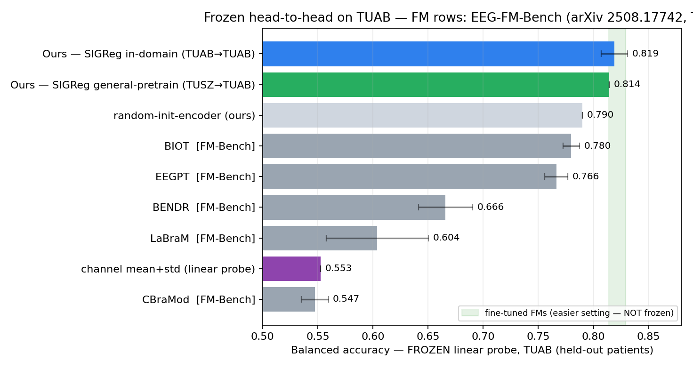
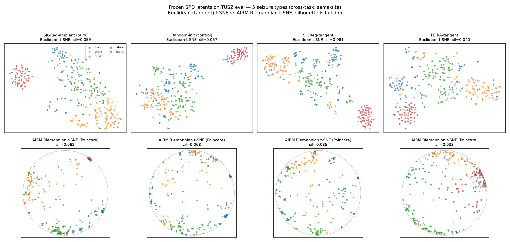

# Hello Worlds

### Geometry-aware EEG representation learning

**Finalist - Hack the World(s), June 2026**

24-hour hackathon on JEPAs and world models, sponsored by Yann LeCun.

[Code](https://github.com/Tariolle/hello-worlds) |
[Final deck](presentation/main.pdf) | [Research handoff](docs/research_handoff.md)

**Team:** [Florent Tariolle](https://tariolle.github.io/) |
[Clement Genninasca](https://github.com/Clems06) |
[Yoann Frayce](https://github.com/Seveyus) |
[Hippolyte du Pac](https://github.com/hdupac)

This repository is the final artifact of a 24h geometry-aware EEG
representation-learning project: a strong SIGReg baseline, and evidence that
SPD-tangent geometry makes the learned latent structure more visible. We
pretrain on unlabeled TUAB recordings, freeze the encoder, and fit a linear
probe for normal-versus-abnormal EEG on a patient-disjoint evaluation split.

## What we found

- **Performance:** the in-domain SIGReg baseline reaches **0.819 balanced
  accuracy** and roughly **0.89 AUROC** across three seeds.
- **Geometry:** in the controlled ambient-versus-SPD-tangent and
  SIGReg-versus-PEIRA comparison, every cell is near 0.82. The tangent-space
  variant does not give a reliable frozen-probe gain, but AIRM-aware
  visualization exposes latent structure that a Euclidean view can obscure.
  This is qualitative geometric evidence, not a performance claim.



The visualization below is computed from frozen SPD latent covariances on TUSZ
seizure-type events. Labels are applied only afterwards for interpretation: the
AIRM-aware view makes the learned organization more apparent, but it is not a
substitute for held-out metrics. The AIRM Riemannian t-SNE visualization follows
Thibault de Surrel's [r_tSNE_in_C](https://github.com/thibaultdesurrel/r_tSNE_in_C)
work.



This is a symmetric two-view invariance objective with an explicit anti-collapse
regularizer. It is JEPA-inspired, but it is not an EMA-teacher I-JEPA/V-JEPA
implementation and it does not train a temporal predictor.

## Retained core implementation

The final artifact is the two-view TUAB/TUSZ/TUEV pipeline below - **not** the
archived Graph-JEPA or Fourier-JEPA explorations.

- [Training pipeline](examples/eeg/main.py): two-view SSL pretraining and the
  ambient-versus-SPD-tangent regularization switch.
- [Frozen evaluation](examples/eeg/eval.py) and
  [TUAB baselines/benchmark](examples/eeg/benchmark.py).
- [EEG encoder](examples/eeg/encoder.py) and
  [SIGReg/BCS loss](eb_jepa/losses.py).
- [PEIRA](examples/eeg/peira.py) and
  [SPD-tangent geometry](examples/eeg/geometry.py).
- [AIRM/tangent visualization](examples/eeg/riemann_latent.py), with matching
  [TUSZ](examples/eeg/riemann_latent_tusz.py) and
  [TUEV](examples/eeg/riemann_latent_tuev.py) paths.

## Reproduce the retained TUAB path

```bash
uv venv
uv pip install -e .

DATA=<TUAB_PREPROCESSED>

# CPU baselines
python -m examples.eeg.baseline_riemann --data-root $DATA
python -m examples.eeg.baseline_chanstats --data-root $DATA --n-windows 8

# Two-view SSL pretraining and frozen evaluation
python -m examples.eeg.main --fname examples/eeg/cfgs/train.yaml
python -m examples.eeg.eval --ckpt ./checkpoints/<run>/latest.pth.tar --floor

# Rebuild benchmark figures and the deck
python -m examples.eeg.benchmark
cd presentation && make
```

For TUEV/TUSZ transfer and geometry commands, see the corresponding module
docstrings and the notes in `docs/`. Dataset files, checkpoints, scheduler logs,
and generated experiment runs are intentionally not versioned.

## Project status

This is a frozen hackathon artifact. [Manifold-JEPA](https://github.com/Tariolle/manifold-jepa)
is the separate repository for the follow-up anomaly-detection research; this
repository remains the provenance-preserving record of the 24h project.

## Experimental contract

| Regularizer | Ambient Euclidean | SPD tangent |
|---|---:|---:|
| VICReg | C0 reference | - |
| SIGReg | C1 baseline | C2 geometry-aware |
| PEIRA | C3 | C4 pre-registered hypothesis |

- **Data:** TUAB, 2,717 train and 276 evaluation recordings; the split is
  patient-disjoint.
- **Protocol:** SSL uses no labels during pretraining; the frozen linear probe is
  trained only after representation learning.
- **Headline metric:** three-seed balanced accuracy. The best single seed, 0.833,
  is not the reported result.
- **Controls:** random-init encoder floor (~0.79), supervised baseline, channel
  mean/std baseline, and a classical Riemannian covariance baseline.

## Secondary evidence and caveats

- **TUSZ to TUAB:** a general-TUH pretraining run reaches 0.814 balanced accuracy
  and 0.889 AUROC when frozen and probed on TUAB. This is one seed and same-site
  evidence, not a broad cross-site claim.
- **TUEV:** the repository retains a conventional SIGReg train/probe pipeline and
  Riemannian visualizations as a secondary cross-task track. Its relationship to
  the TUAB pretraining split remains caveated; it is not a headline result.
- **Visualization:** labels are applied after embedding for interpretation only.
  t-SNE/UMAP-style plots never substitute for held-out metrics, leakage checks, or
  seed variation.

## Repository layout

```text
eb_jepa/                 minimal vendor: EEG dataset and anti-collapse losses
examples/eeg/            retained TUAB/TUSZ/TUEV training, probes, geometry, and figures
cluster/                 retained Dalia/SLURM launch recipes
results/                 curated core measured tables and figures
presentation/            final deck source and compiled PDF
docs/                    positioning, geometry notes, and research handoff
references/              short literature notes
archive/                 explicitly non-headline Graph-JEPA and Fourier-JEPA explorations
```

### Archived explorations

[Graph-JEPA](archive/graph_jepa/) and [Fourier-JEPA](archive/fourier_jepa/) are
preserved as self-contained explorations. They are not part of the controlled
conclusion above and should not be read as competing headline results.

## Honest positioning

The repository does **not** claim a foundation model, SOTA, or that geometry
improves TUAB frozen accuracy. It records a strong frozen SIGReg baseline, a
controlled null result for the geometry-as-frozen-accuracy hypothesis, and the
follow-up question: where, if anywhere, geometry improves EEG representation
quality beyond this narrow frozen-probe setting.

See `docs/positioning.md`, `docs/geometry_tangent_analysis.md`, and
`docs/research_handoff.md` for the detailed claims and next-step constraints.

## License

This repository is licensed under the Apache License, Version 2.0. A trimmed
vendored subset of `facebookresearch/eb_jepa` is retained under `eb_jepa/`; see
[`THIRD_PARTY_NOTICES.md`](THIRD_PARTY_NOTICES.md) for provenance.
